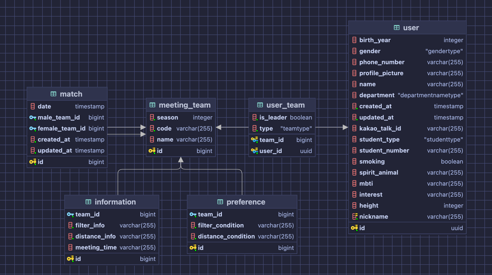

# server-meeting

서울시립대학교 학생들을 위한 미팅 서비스를 제공하는 프로젝트 시대팅의 서버 레포지토리입니다.

[](https://codecov.io/gh/uoslife/server-meeting)

- API Docs : [swagger](https://meeting.uoslife.com/api/swagger-ui/index.html)

## Environment

### requirements
- Kotlin & JDK 17
- Springboot 3.0.5

### installation
```bash
# installation
$ git clone https://github.com/uoslife/server-meeting
$ cd server-meeting

# application file
$ touch src/main/resources/application.yml

# build
$ ./gradlew build
```

### ERD


