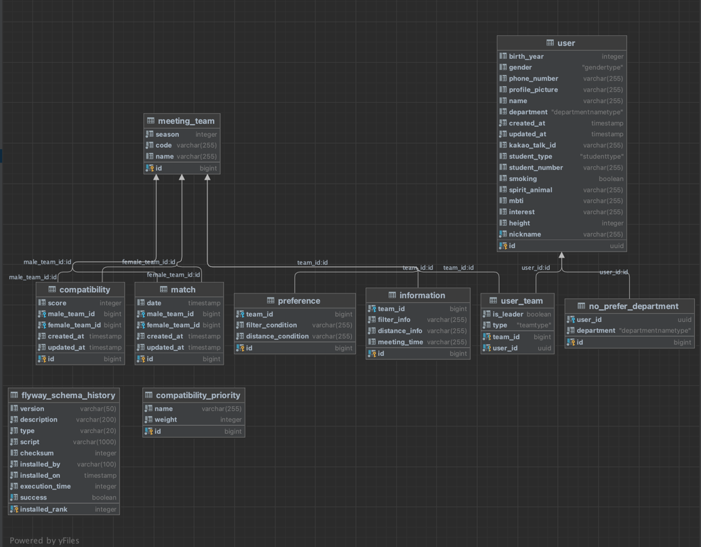

# server-meeting

시대팅 시즌3 server

## ERD

### User

| 키               | 논리                  | 물리                  | 타입         | Null 허용 | 기본값 | 코멘트                          |
|-----------------|-----------------------|-----------------------|--------------|---------|--------|---------------------------------|
| PK              | user_id               | user_id               | INT          | N       |        |                                 |
| FK              | department_id         | department_id         | INT          | N       |        |                                 |
|                 | 생년                  | age                   | INT          | N       |        | 주민번호앞자리의 첫 두 숫자         |
|                 | gender                | gender                | VARCHAR(255) | N       |        |                                 |
|                 | phone_number          | phone_number          | VARCHAR(255) | N       |        |                                 |
|                 | profile_picture      | profile_picture      | VARCHAR(255) | N       |        |                                 |
|                 | registration_date     | registration_date     | DATE         | N       |        |                                 |
|                 | last_modified_date    | last_modified_date    | DATE         | N       |        |                                 |
|                 | 별명                  | nickname              | VARCHAR      | N       |        |                                 |
|                 | 이름                  | name                  | VARCHAR(255) | N       |        |                                 |
|                 | auth_id               | auth_id               | VARCHAR(255) | N       |        | 시대생 서버의 uuid              |

### Preferences

| 키   | 논리                      | 물리                      | 타입           | Null 허용 | 기본값 | 코멘트                                                                                                              |
|-----|-------------------------|-------------------------|--------------|---------|-----|------------------------------------------------------------------------------------------------------------------|
| PK  | preference_id           | preference_id           | INT          | N       |     |                                                                                                                  |
| FK  | team_id                 | team_id                 | INT          | N       |     |                                                                                                                  |
|     | age_range_preference    | age_range_preference    | BYTE         | N       |     | 현재 년도 - 29가 MSB, 현재 년도 - 19가 LSB                                                                                 |
|     | height_range_preference | height_range_preference | BYTE         | N       |     | 대한민국 신체 분포표 참고, 남자 165미만이 MSB, 남자 165~170, 남자 171~175, 남자 176~180, 남자 180 ~ 185, 남자 185 이상이 LSB, 총 6bit, 여자는 -10 |
|     | filter_condition        | filter_condition        | BYTE         | N       |     | 서로 일치 하지 않으면 매칭이 안되는 질문에 대한 답변, bit 이용 ex) MBTI이면 4bit 이용해서 연속해서 기록할 것                                           |
|     | distance_condition      | distance_condition      | VARCHAR(255) | N       |     | 서로의 차이에 대한 점수, 연속된 정수이용, 만약 각 값이 10 넘을 경우 scale 이용 ex) 3개의 답변 345, 만약 3,10,5 일 경우 10                             |

### Match

| Key | Logical | Physical | Type | Null Allowed | Default | Comment |
|-----|---------|----------|------|--------------|---------|---------|
| FK  | team_male_id | team_male_id | INT  | N  |         |         |
| FK  | team_female_id | team_female_id | INT  | N  |         |         |
| PK  | match_id | match_id | INT  | N  |         |         |
|     | match_date | match_date | DATE  | N  |         |         |

### Payment

| Key | Logical | Physical | Type | Null Allowed | Default | Comment |
|-----|---------|----------|------|--------------|---------|---------|
| PK, FK  | user_id | user_id | INT  | N  |         |         |
| PK  | payment_id | payment_id | INT  | N  |         |         |
|     | amount | amount | INT  | N  |         |         |
|     | payment_date | payment_date | DATE  | N  |         |         |
|     | payment_identifier | payment_identifier | VARCHAR(255)  | N  |         |         |
|     | payment_status | payment_status | VARCHAR(255)  | N  |         |         |
|     | refund_account_number | refund_account_number | VARCHAR(255)  | N  |         |         |
|     | refund_account_bank | refund_account_bank | VARCHAR(255)  | N  |         |         |
|     | refund_need | refund_need | BOOLEAN  | N  |         |         |
|     | admin_memo | admin_memo | TEXT  | N  |         |         |
|     | admin_check_flag | admin_check_flag | TINYINT  | N  |         | Administrator adjustment flag |
|     | error_flag | error_flag | TINYINT  | N  |         | Error flag |

### Report

| Key | Logical | Physical | Type | Null Allowed | Default | Comment |
|-----|---------|----------|------|--------------|---------|---------|
| PK  | report_id | report_id | INT  | N            |         | Service inquiry board |
| FK  | user_id | user_id | INT  | N            |         |         |
|     | report_category | report_category | VARCHAR(255)  | N            |         | Amount, no-show, etc. |
|     | report_date | report_date | DATE  | N            |         |         |
|     | admin_response | admin_response | TEXT  | N            |         |         |
|     | report_text | report_text | TEXT  | N            |         |         |

### Compatibility

| Key | Logical | Physical | Type | Null Allowed | Default | Comment     |
|-----|---------|----------|------|--------------|---------|-------------|
| PK  | compatibility_id | compatibility_id | INT  | N            |         |             |
|     | compatibility_score | compatibility_score | INT  | N            |         | 두 팀간의 궁합 점수 |
| FK  | team_male_id | team_male_id | INT  | N            |         |             |
| FK  | team_female_id | team_female_id | INT  | N            |         |             |

### Compatibility_Priority

| Key | Logical | Physical | Type | Null Allowed | Default | Comment                                                         |
|-----|---------|----------|------|--------------|---------|-----------------------------------------------------------------|
| PK  | priority_id | priority_id | INT  | N            |         |                                                                 |
|     | compatibility_name | compatibility_name | VARCHAR(255)  | N            |         | Name of each comparison factor (e.g., question,MBTI, TIME etc.) |
|     | compatibility_weight | compatibility_weight | INT  | N            |         | Weight of the comparison factor                                 |

### Departments
학부과 정보(대학알림이 이용)
| Key | Logical | Physical | Type | Null Allowed | Default | Comment |
|-----|---------|----------|------|--------------|---------|---------|
| PK  | department_id | department_id | INT  | N  |         |         |
|     | department_name | department_name | VARCHAR(255)  | N  |         |         |
|     | department_number | department_number | INT  | N  |         |         |

### No_prefer_departments
기피학과

| Key | Logical | Physical | Type | Null Allowed | Default | Comment |
|-----|---------|----------|------|--------------|---------|---------|
| FK  | user_id | user_id | INT  | N  |         |         |
| FK  | department_id | department_id | INT  | N  |         |         |

### Meeting_Teams

| Key | Logical | Physical | Type | Null Allowed | Default | Comment |
|-----|---------|----------|------|--------------|---------|---------|
| PK  | team_id | team_id | INT  | N            |         |         |
|     | season | season | INT  | N            |         |         |
|     | code | code | VARCHAR(255)  | N            |         |         |

### User_Teams

| Key | Logical | Physical | Type | Null Allowed | Default | Comment |
|-----|---------|----------|------|--------------|---------|---------|
| FK  | team_id | team_id | INT  | N            |         |         |
| FK  | user_id | user_id | INT  | N            |         |         |
|     | is_leader | is_leader | BOOLEAN  | N            |         |         |
|     | type | type | VARCHAR  | N            |         |         |

### Informations

| Key | Logical | Physical | Type | Null Allowed | Default | Comment     |
|-----|---------|----------|------|--------------|---------|-------------|
| PK  | information_id | information_id | INT  | N            |         |             |
| FK  | team_id | team_id | INT  | N            |         |             |
|     | meeting_location | meeting_location | VARCHAR(255)  | N            |         |             |
|     | meeting_time | meeting_time | DATE  | N            |         |             |
|     | age | age | BYTE  | N            |         | bit이용해서 표기  |
|     | height | height | BYTE  | N            |         | bit 이용해서 표기 |
|     | filter_info | filter_info | VARCHAR(255)  | N            |         |             |
|     | distance_info | distance_info | VARCHAR(255)  | N            |         |             |

## API 명세서
